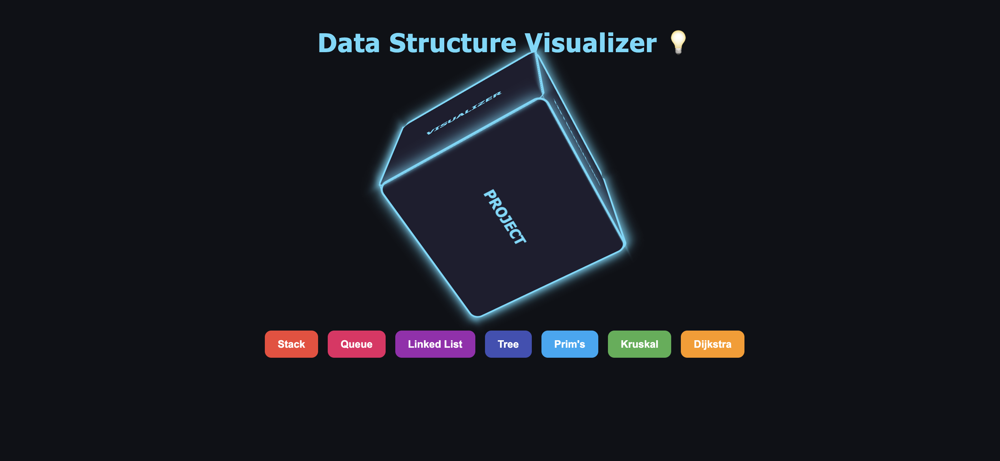
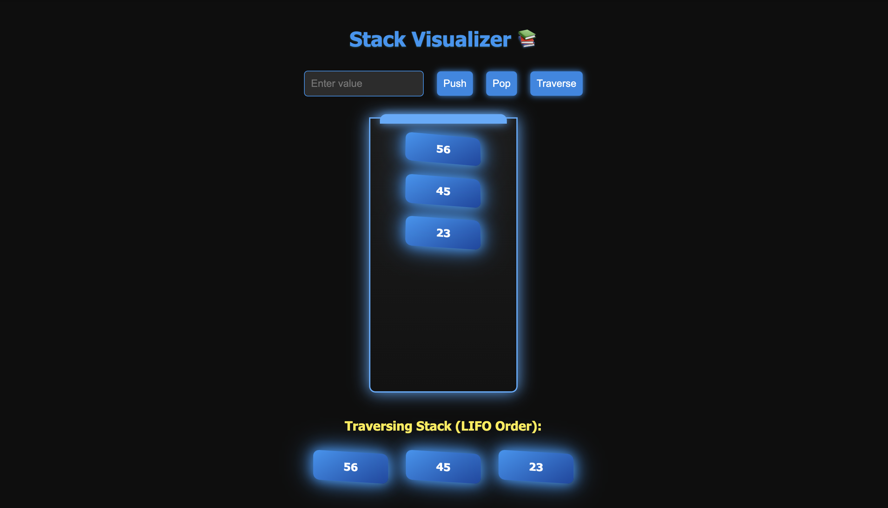
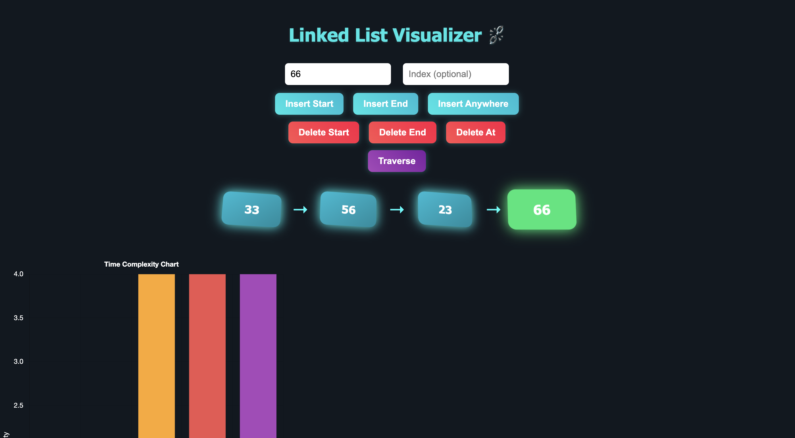
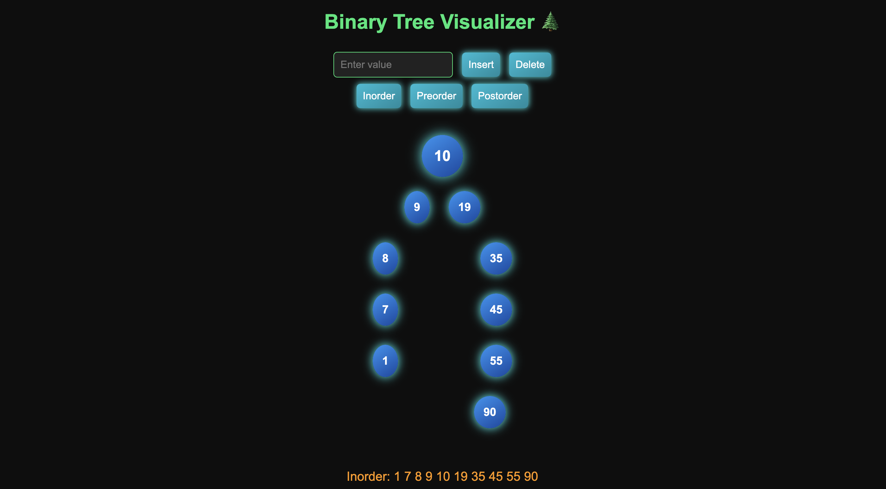
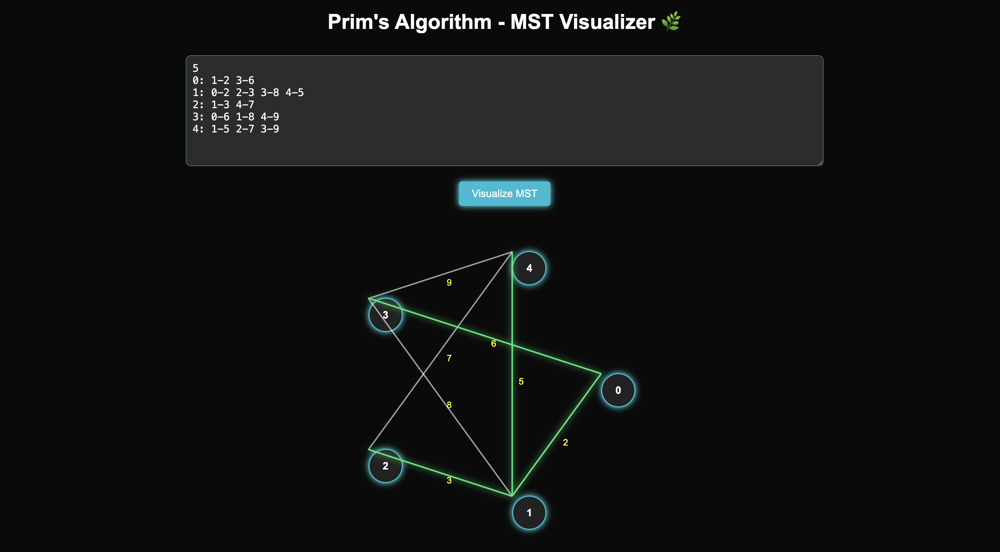
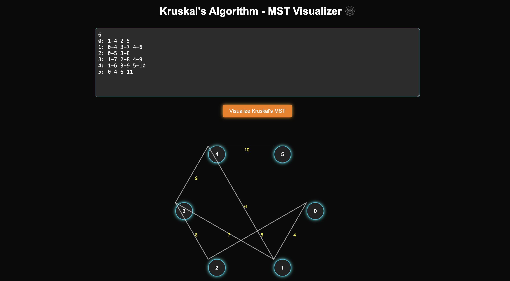
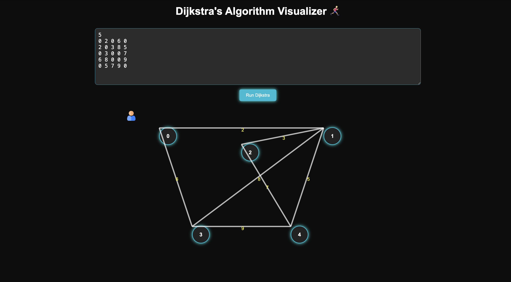

<h1 align="center">🧠 Interactive DSA Visualizer Platform</h1>

<p align="center">
  🚀 Interactive DSA Visualizer: A comprehensive full-stack web application that turns complex data structures and algorithms into intuitive, interactive visualizations, helping students and developers understand and master core programming concepts.
</p>

<p align="center">
  
  
  
  
  
  
</p>
<br>

---

## 📖 Problem Statement
Data Structure and Algorithm Visualizer: Computer Science students and developers struggle with understanding abstract data structures and algorithms through traditional textbook learning, lack of interactive visualization tools for complex algorithms, difficulty in debugging and tracing algorithm execution steps, and limited hands-on practice with real-time algorithm implementation in modern education systems.

<br>

---

## 💡 Our Solution
DSV is a full-stack interactive visualization platform built to:

- 📊 Visualize 7+ core data structures with real-time animations and step-by-step execution
- 🎯 Execute algorithms with custom input and trace every operation with detailed output
- 🌍 Provide interactive learning experience across Stack, Queue, Linked List, Trees, and Graph algorithms
- 📈 Deliver instant algorithm execution with C backend processing and Flask API integration
- 💾 Export algorithm results and trace execution steps for educational analysis
<br>

---  

## 🚀 Features

✅  **Interactive Data Structure Visualization** with real-time animations and step tracking  
✅  **Algorithm Execution Engine** with custom input processing and detailed output display  
✅  **Graph Algorithm Implementation** including Dijkstra, Prim's, and Kruskal algorithms  
✅  **Educational Interface** with intuitive controls and comprehensive algorithm explanations  
✅  **Real-time Processing** with C backend execution and Flask API integration  
✅  **Responsive Design** with modern UI/UX and cross-platform compatibility  
✅  **Step-by-step Tracing** with detailed algorithm execution visualization and debugging support

<br>

---  

## 🛠️ Tech Stack

<div align="center">

<table>
<thead>
<tr>
<th>🖥️ Technology</th>
<th>⚙️ Description</th>
</tr>
</thead>
<tbody>
<tr>
<td></td>
<td>Python web framework for API and routing</td>
</tr>
<tr>
<td></td>
<td>High-performance algorithm implementation</td>
</tr>
<tr>
<td></td>
<td>Interactive frontend visualization and animations</td>
</tr>
<tr>
<td></td>
<td>Modern web structure and semantic markup</td>
</tr>
<tr>
<td></td>
<td>Responsive design and visual styling</td>
</tr>
<tr>
<td></td>
<td>Backend processing and subprocess management</td>
</tr>
</tbody>
</table>

</div>

<br>

---

## 📁 Project Directory Structure

```
DSV/
├── 📂 docs/                        # 📸 Screenshot documentation
│   ├── 📄 Home_Page.png            # 🏠 Landing page interface
│   ├── 📄 Stack.png                # 📚 Stack visualization
│   ├── 📄 Queue.png                # 🔄 Queue operations
│   ├── 📄 LinkedList.png           # 🔗 Linked list structure
│   ├── 📄 Tree.png                 # 🌳 Tree traversal
│   ├── 📄 Prim_Graph.png           # 🌐 Prim's algorithm
│   ├── 📄 Kruskal_Graph.png        # 🔗 Kruskal's MST
│   └── 📄 Dijkstra_Graph.png       # 🛣️ Shortest path algorithm
├── 📂 Graph/                       # 🌐 Graph algorithms
│   ├── 📂 Dijkstra/               # 🛣️ Shortest path implementation
│   │   ├── 📄 dijkstra.c           # 💻 C algorithm implementation
│   │   ├── 📄 dijkstra_exec        # ⚡ Compiled executable
│   │   ├── 📄 input.txt            # 📝 Algorithm input data
│   │   └── 📄 output.txt           # 📊 Execution results
│   ├── 📂 Kruskal/                # 🔗 Minimum spanning tree
│   │   ├── 📄 kruskal.c            # 💻 MST algorithm
│   │   ├── 📄 kruskal_exec         # ⚡ Compiled binary
│   │   ├── 📄 input.txt            # 📝 Graph input
│   │   └── 📄 output.txt           # 📊 MST results
│   └── 📂 Prims/                   # 🌐 Prim's algorithm
│       ├── 📄 prims.c              # 💻 Algorithm implementation
│       ├── 📄 prims_exec           # ⚡ Executable file
│       ├── 📄 input.txt            # 📝 Input data
│       └── 📄 output.txt           # 📊 Algorithm output
├── 📂 LinkedList/                  # 🔗 Linked list operations
│   ├── 📄 linkedlist.c             # 💻 List implementation
│   ├── 📄 linkedlist_exec          # ⚡ Compiled program
│   ├── 📄 input.txt                # 📝 List operations
│   └── 📄 output.txt               # 📊 Execution trace
├── 📂 Queue/                       # 🔄 Queue data structure
│   ├── 📄 queue.c                  # 💻 Queue implementation
│   ├── 📄 queue_exec               # ⚡ Executable binary
│   ├── 📄 input.txt                # 📝 Queue operations
│   └── 📄 output.txt               # 📊 Operation results
├── 📂 Stack/                       # 📚 Stack operations
│   ├── 📄 stack.c                  # 💻 Stack implementation
│   ├── 📄 stack_exec               # ⚡ Compiled executable
│   ├── 📄 input.txt                # 📝 Stack operations
│   └── 📄 output.txt               # 📊 Stack trace
├── 📂 Tree/                        # 🌳 Tree data structure
│   ├── 📄 tree.c                   # 💻 Tree implementation
│   ├── 📄 tree_exec                # ⚡ Tree executable
│   ├── 📄 input.txt                # 📝 Tree operations
│   └── 📄 output.txt               # 📊 Traversal results
├── 📂 static/                      # 🎨 Frontend assets
│   ├── 📄 dijkstra.js              # 🛣️ Dijkstra visualization
│   ├── 📄 kruskal.js               # 🔗 Kruskal animation
│   ├── 📄 linkedlist.js            # 🔗 List visualization
│   ├── 📄 prims.js                 # 🌐 Prim's animation
│   ├── 📄 queue.js                 # 🔄 Queue visualization
│   ├── 📄 stack.js                 # 📚 Stack animation
│   ├── 📄 tree.js                  # 🌳 Tree visualization
│   └── 📄 style.css                # 🎨 Global styling
├── 📂 templates/                   # 🌐 HTML templates
│   ├── 📄 index.html               # 🏠 Main dashboard
│   ├── 📄 stack.html               # 📚 Stack interface
│   ├── 📄 queue.html               # 🔄 Queue interface
│   ├── 📄 linkedlist.html          # 🔗 List interface
│   ├── 📄 tree.html                # 🌳 Tree interface
│   ├── 📄 prims.html               # 🌐 Prim's interface
│   ├── 📄 kruskal.html             # 🔗 Kruskal interface
│   └── 📄 dijkstra.html            # 🛣️ Dijkstra interface
├── 📄 app.py                       # 🚀 Flask application server
├── 📄 README.md                    # 📖 Project documentation
└── 📄 .gitignore                   # 🚫 Git ignore rules
```
<br>

## 📸 Preview Images

| 📍 Data Structure / Algorithm    | 📸 Screenshot                                              |
|:--------------------------------|:-----------------------------------------------------------|
| Home Dashboard                  |                           |
| Stack Operations                |                                   |
| Queue Implementation            |                                   |
| Linked List Visualization      |                        |
| Tree Traversal                  |                                     |
| Prim's Algorithm                |                   |
| Kruskal's MST                   |               |
| Dijkstra's Shortest Path       |             |

<br>

---

## 📦 How to Run

### 📌 Prerequisites
- ✅ **Python 3.8+** installed
- ✅ **GCC Compiler** for C programs
- ✅ **Flask** web framework
- ✅ **Git** for cloning repository

<br>

---  

### 🚀 Quick Start

1. Clone and setup the project:

   ```bash
   git clone https://github.com/AbhishekGiri2004/DSA-Visualizer
   cd DSA-Visualizer
   pip install flask
   ```

2. Compile C programs:

   ```bash
   # Compile all data structure implementations
   gcc Stack/stack.c -o Stack/stack_exec
   gcc Queue/queue.c -o Queue/queue_exec
   gcc LinkedList/linkedlist.c -o LinkedList/linkedlist_exec
   gcc Tree/tree.c -o Tree/tree_exec
   gcc Graph/Prims/prims.c -o Graph/Prims/prims_exec
   gcc Graph/Kruskal/kruskal.c -o Graph/Kruskal/kruskal_exec
   gcc Graph/Dijkstra/dijkstra.c -o Graph/Dijkstra/dijkstra_exec
   ```

3. Start the application:

   ```bash
   python app.py
   ```

4. Access the platform:

   ```
   Application: http://localhost:5000
   ```

### 🔧 Manual Setup

```bash
# Install dependencies
pip install flask

# Make executables (if needed)
chmod +x Stack/stack_exec
chmod +x Queue/queue_exec
chmod +x LinkedList/linkedlist_exec
chmod +x Tree/tree_exec
chmod +x Graph/Prims/prims_exec
chmod +x Graph/Kruskal/kruskal_exec
chmod +x Graph/Dijkstra/dijkstra_exec

# Run application
python app.py
```
<br>

---

## 📖 Core Components

* **app.py** — Flask server with routing, API endpoints, and subprocess management
* **stack.c** — Stack data structure implementation with push, pop, and display operations
* **queue.c** — Queue implementation with enqueue, dequeue, and traversal functions
* **linkedlist.c** — Linked list operations including insertion, deletion, and search
* **tree.c** — Binary tree implementation with traversal algorithms (inorder, preorder, postorder)
* **prims.c** — Prim's minimum spanning tree algorithm implementation
* **kruskal.c** — Kruskal's MST algorithm with union-find data structure
* **dijkstra.c** — Dijkstra's shortest path algorithm for weighted graphs

<br>

---

## 🌐 API Endpoints

```bash
# Flask Application (Port 5000)
GET  /                      # Main dashboard interface
GET  /stack                 # Stack visualization page
POST /stack/run             # Execute stack operations
GET  /stack/result          # Get stack execution results
GET  /queue                 # Queue visualization page
POST /queue/run             # Execute queue operations
GET  /queue/result          # Get queue execution results
GET  /linkedlist            # Linked list interface
POST /linkedlist/run        # Execute list operations
GET  /linkedlist/result     # Get list execution results
GET  /tree                  # Tree visualization page
POST /tree/run              # Execute tree operations
GET  /tree/result           # Get tree execution results
GET  /prims                 # Prim's algorithm page
POST /prims/run             # Execute Prim's MST
GET  /prims/result          # Get MST results
GET  /kruskal               # Kruskal algorithm page
POST /kruskal/run           # Execute Kruskal MST
GET  /kruskal/result        # Get Kruskal results
GET  /dijkstra              # Dijkstra algorithm page
POST /dijkstra/run          # Execute shortest path
GET  /dijkstra/result       # Get path results
```
<br>

---

## 🧪 Testing

```bash
# Test Flask application
python app.py

# Test individual algorithms
./Stack/stack_exec < Stack/input.txt
./Queue/queue_exec < Queue/input.txt
./LinkedList/linkedlist_exec < LinkedList/input.txt
./Tree/tree_exec < Tree/input.txt
./Graph/Prims/prims_exec < Graph/Prims/input.txt
./Graph/Kruskal/kruskal_exec < Graph/Kruskal/input.txt
./Graph/Dijkstra/dijkstra_exec < Graph/Dijkstra/input.txt

# Test web interface
curl http://localhost:5000/
curl -X POST http://localhost:5000/stack/run -H "Content-Type: application/json" -d '{"input":"1 2 3"}'
```

## ⚠️ Common Issues

**Compilation errors:**
```bash
# Install GCC compiler
sudo apt-get install gcc  # Ubuntu/Debian
brew install gcc          # macOS

# Recompile programs
gcc Stack/stack.c -o Stack/stack_exec
```

**Permission denied:**
```bash
chmod +x Stack/stack_exec
chmod +x Queue/queue_exec
chmod +x LinkedList/linkedlist_exec
chmod +x Tree/tree_exec
chmod +x Graph/Prims/prims_exec
chmod +x Graph/Kruskal/kruskal_exec
chmod +x Graph/Dijkstra/dijkstra_exec
```

**Flask not found:**
```bash
pip install flask
python app.py
```
<br>

---

## 📊 Performance Metrics

- **7+ Data Structures** — Comprehensive coverage of core CS concepts with interactive visualization
- **Real-time Execution** — Instant algorithm processing with C backend performance optimization
- **Cross-platform Support** — Compatible with Windows, macOS, and Linux operating systems
- **Educational Focus** — Step-by-step algorithm tracing with detailed execution visualization
- **Interactive Interface** — User-friendly web interface with responsive design and animations
- **Algorithm Efficiency** — Optimized C implementations with O(log n) to O(n²) complexity analysis

<br>

---

## 🌱 Future Scope
- 📱 **Mobile Application** — Cross-platform mobile app for iOS and Android devices

- 🎮 **Gamification** — Interactive challenges, coding competitions, and achievement systems

- 📊 **Advanced Algorithms** — Dynamic programming, backtracking, and advanced graph algorithms

- 🔐 **User Authentication** — Personal progress tracking, saved algorithms, and user profiles

- 🚀 **Cloud Deployment** — AWS/Azure hosting with scalable infrastructure and load balancing

- 🎬 **Algorithm Animation** — Enhanced 3D visualizations, step-by-step animations, and interactive tutorials

  <br>

  ---  

## 📞 Help & Contact  

> 💬 *Got questions or need assistance with DSV Platform?*  
> We're here to help with technical support and collaboration!

<div align="center">

<b>👤 Abhishek Giri</b>  
<a href="https://www.linkedin.com/in/abhishek-giri04/">
  
</a>  
<a href="https://github.com/abhishekgiri2004">
  
</a>  
<a href="https://t.me/AbhishekGiri7">
  
</a>

<br/>

---

**🧠 Built with ❤️ for Computer Science Education**  
*Transforming Algorithm Learning Through Interactive Visualization*

</div>

---

<div align="center">

**© 2025 DSV - Data Structure Visualizer Platform. All Rights Reserved.**

</div>